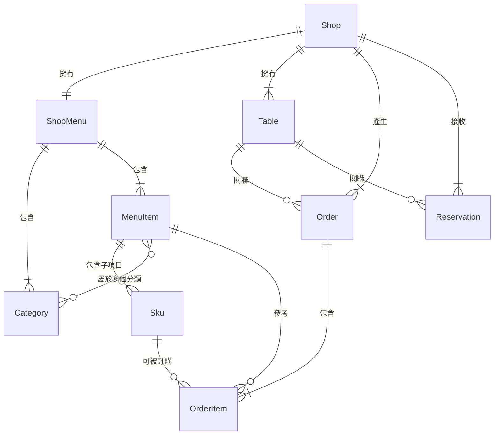

# SmartOrder 資料結構規範 (Data Structure Specification)

本文件定義了 SmartOrder 系統中核心實體（Entity）的資料結構，供開發人員與 AI 助理參考，確保資料一致性並利於未來遷移至雲端資料庫（如 Supabase/PostgreSQL）。

## 1. 店鋪體系 (Shop System)

店鋪是系統的核心實體，所有菜單、訂單、訂位皆歸屬於特定店鋪。

### A. Shop (店鋪)
| 欄位名 | 類型 | 說明 |
| :--- | :--- | :--- |
| `id` | `string` (UUID) | 店鋪唯一識別碼 |
| `name` | `string` | 店鋪名稱 |
| `ownerId` | `string` | 擁有者 ID |
| `createdAt` | `number` (Timestamp) | 建立時間 |

### B. Table (桌號)
| 欄位名 | 類型 | 說明 |
| :--- | :--- | :--- |
| `id` | `string` (UUID) | 桌號唯一識別碼 |
| `shopId` | `string` | 所屬店鋪的 ID (外鍵) |
| `tableNo` | `string` | 桌號名稱 (如 "A", "B", "C") |

---

## 2. 菜單體系 (Menu System)

菜單結構設計為「店鋪對應單一菜單」模式，支持 AI 解析後的結構化存儲。

### A. ShopMenu (菜單主體)
| 欄位名 | 類型 | 說明 |
| :--- | :--- | :--- |
| `id` | `string` (UUID) | 菜單唯一識別碼 |
| `shopId` | `string` | 所屬店鋪的 ID (外鍵) |
| `brandName` | `string` | 品牌/餐廳名稱 (由 AI 從圖片解析或手動輸入) |
| `categories` | `Category[]` | 菜品分類陣列 |
| `items` | `MenuItem[]` | 菜品細項陣列 |
| `isPublished` | `boolean` | 是否已發布（發布後方可生成點餐 QR Code） |

### B. Category (分類)
| 欄位名 | 類型 | 說明 |
| :--- | :--- | :--- |
| `id` | `string` (UUID) | 分類唯一識別碼 |
| `name` | `string` | 分類名稱，如 "主食"、"甜點"、"飲料" |
| `sortOrder` | `number` (Optional) | 排序順序 (數字越小越前面) |
| `isActive` | `boolean` | 是否啟用 (可用於暫時隱藏某分類) |

### C. MenuItem (菜品項目)
| 欄位名 | 類型 | 說明 |
| :--- | :--- | :--- |
| `id` | `string` (UUID) | 菜品唯一識別碼 |
| `name` | `string` | 菜色名稱 |
| `price` | `number` | 單價 |
| `categoryIds` | `string[]` | 所屬分類 ID 陣列 (外鍵,對應 `Category.id`),支援多分類 |
| `image` | `string` (Optional) | 菜品圖片 URL 或 Base64 編碼字串 |
| `stock` | `Stock` (Optional) | 存貨管理資訊 |
| `availability` | `Availability` (Optional) | 時段管理資訊 |
| `skus` | `Sku[]` (Optional) | 子項目陣列 (如:大/中/小杯、不同口味等規格) |

#### C-1. Sku (子項目/規格)
用於管理同一菜品的不同規格選項,例如飲料的大中小杯、套餐的不同配菜組合等。

| 欄位名 | 類型 | 說明 |
| :--- | :--- | :--- |
| `id` | `string` (UUID) | 子項目唯一識別碼 |
| `name` | `string` | 子項目名稱 (如 "大杯"、"中杯"、"加珍珠") |
| `price` | `number` (Optional) | 價格 (若未設定則繼承父項 MenuItem 的價格) |
| `image` | `string` (Optional) | 子項目專屬圖片 |
| `stock` | `Stock` (Optional) | 獨立的存貨管理 |
| `availability` | `Availability` (Optional) | 獨立的時段管理 |

**使用情境**:
- **飲料尺寸**: 珍珠奶茶 → SKU: 大杯(+10元)、中杯(原價)、小杯(-5元)
- **套餐選項**: 商業午餐 → SKU: A餐(雞肉)、B餐(豬肉)、C餐(魚肉)
- **客製化**: 咖啡 → SKU: 加糖、半糖、無糖
- 未設定 `skus`: 表示該菜品無子項目,直接販售

**圖片上傳說明**:
- 支援格式: JPG, PNG, WebP
- 儲存方式:
  - **Base64 編碼**: 直接儲存於 JSON 檔案中 (適用於小型圖片,< 200KB)
  - **URL**: 上傳至雲端儲存服務後儲存 URL (建議用於生產環境)
- 未來遷移至雲端資料庫時,建議使用專用的圖床服務 (如 Cloudinary, AWS S3)

#### D. Stock (存貨管理)
| 欄位名 | 類型 | 說明 |
| :--- | :--- | :--- |
| `quantity` | `number` | 庫存數量 |
| `isAvailable` | `boolean` | 是否可售 |
| `lowStockThreshold` | `number` (Optional) | 低庫存警示閾值 |

**使用情境**:
- `quantity > 0 && isAvailable = true`: 正常販售中
- `quantity = 0 && isAvailable = false`: 已售罄
- `quantity < lowStockThreshold`: 觸發低庫存警示
- 未設定 `stock` 欄位: 表示無限供應,不需庫存管理

#### E. Availability (時段管理)
| 欄位名 | 類型 | 說明 |
| :--- | :--- | :--- |
| `timeSlots` | `TimeSlot[]` (Optional) | 供應時段陣列 |
| `isAlwaysAvailable` | `boolean` (Optional) | 是否全時段供應 |

**TimeSlot (時段)**:
| 欄位名 | 類型 | 說明 |
| :--- | :--- | :--- |
| `startTime` | `string` | 開始時間 (格式: "HH:mm",例如 "11:00") |
| `endTime` | `string` | 結束時間 (格式: "HH:mm",例如 "14:00") |
| `days` | `number[]` (Optional) | 適用星期 (0=週日, 1=週一, ..., 6=週六) |

**使用情境**:
- `isAlwaysAvailable = true`: 全天候供應,忽略 `timeSlots`
- `timeSlots` 有值且 `isAlwaysAvailable = false`: 僅在指定時段供應
- 未設定 `availability` 欄位: 預設為全時段供應
- `days` 未設定: 表示每天都適用該時段

**完整範例**:
```json
{
  "id": "menu-001",
  "shopId": "shop-001",
  "brandName": "美味餐廳",
  "categories": [
    {
      "id": "cat-001",
      "name": "套餐",
      "sortOrder": 1,
      "isActive": true
    },
    {
      "id": "cat-002",
      "name": "飲料",
      "sortOrder": 2,
      "isActive": true
    },
    {
      "id": "cat-003",
      "name": "午間限定",
      "sortOrder": 3,
      "isActive": true
    }
  ],
  "items": [
    {
      "id": "item-001",
      "name": "午間限定套餐",
      "price": 280,
      "categoryIds": ["cat-001", "cat-003"],
      "stock": {
        "quantity": 20,
        "isAvailable": true,
        "lowStockThreshold": 5
      },
      "availability": {
        "timeSlots": [
          {
            "startTime": "11:00",
            "endTime": "14:00",
            "days": [1, 2, 3, 4, 5]
          }
        ],
        "isAlwaysAvailable": false
      },
      "skus": [
        {
          "id": "sku-001",
          "name": "雞腿套餐",
          "price": 280
        },
        {
          "id": "sku-002",
          "name": "豬排套餐",
          "price": 280
        },
        {
          "id": "sku-003",
          "name": "魚排套餐",
          "price": 300,
          "stock": {
            "quantity": 5,
            "isAvailable": true,
            "lowStockThreshold": 2
          }
        }
      ]
    },
    {
      "id": "item-002",
      "name": "珍珠奶茶",
      "price": 50,
      "categoryIds": ["cat-002"],
      "skus": [
        {
          "id": "sku-004",
          "name": "大杯",
          "price": 60
        },
        {
          "id": "sku-005",
          "name": "中杯",
          "price": 50
        },
        {
          "id": "sku-006",
          "name": "小杯",
          "price": 40
        }
      ]
    }
  ],
  "isPublished": true
}
```

---

## 3. 訂單體系 (Order System)

訂單紀錄顧客的點餐內容、金額及處理狀態。

### A. Order (訂單主體)
| 欄位名 | 類型 | 說明 |
| :--- | :--- | :--- |
| `id` | `string` (UUID) | 訂單唯一識別碼 |
| `shopId` | `string` | 所屬店鋪的 ID |
| `tableNo` | `string` | 桌號 (如 "A1", "B2") |
| `items` | `OrderItem[]` | 訂購內容陣列 |
| `adjustments` | `OrderAdjustment[]` (Optional) | 加扣項陣列 (折扣、服務費等) |
| `subtotal` | `number` | 小計金額 (items 總和) |
| `totalPrice` | `number` | 訂單總金額 (subtotal + adjustments 後的最終金額) |
| `status` | `'new' \| 'served' \| 'paid'` | 狀態：新訂單、已出餐、已結帳 |
| `createdAt` | `number` (Timestamp) | 建立時間 |

### B. OrderItem (訂單細項)
為了防止菜單日後修改影響歷史訂單，訂單細項會快照當時的價格與名稱。
| 欄位名 | 類型 | 說明 |
| :--- | :--- | :--- |
| `menuItemId` | `string` | 原始菜品 ID (外鍵,對應 `MenuItem.id`) |
| `skuId` | `string` (Optional) | 子項目 ID (外鍵,對應 `Sku.id`),若為 null 表示訂購主項目 |
| `name` | `string` | 點餐時的菜色名稱 (完整名稱,如 "珍珠奶茶 - 大杯") |
| `price` | `number` | 點餐時的單價 |
| `quantity` | `number` | 數量 |

**說明**:
- 當 `skuId` 為空時:表示直接訂購 MenuItem,使用 MenuItem 的價格和名稱
- 當 `skuId` 有值時:表示訂購特定 SKU,使用該 SKU 的價格和組合名稱
- `name` 和 `price` 會在訂單建立時快照,避免後續菜單修改影響歷史訂單

### C. OrderAdjustment (加扣項)
用於處理訂單的額外調整項目,如折扣、服務費、運費等。

| 欄位名 | 類型 | 說明 |
| :--- | :--- | :--- |
| `id` | `string` (UUID) | 加扣項唯一識別碼 |
| `name` | `string` | 加扣項名稱 (如 "會員折扣"、"服務費"、"外送費") |
| `type` | `'discount' \| 'surcharge'` | 類型：discount=折扣(減項)、surcharge=加項 |
| `valueType` | `'fixed' \| 'percentage'` | 計算方式：fixed=固定金額、percentage=百分比 |
| `value` | `number` | 數值 (固定金額或百分比,如 50 表示 50元或50%) |
| `amount` | `number` | 實際加扣金額 (自動計算,正數為加項,負數為減項) |

**計算邏輯**:
- `type = 'discount' && valueType = 'fixed'`: amount = -value (例如: -50元)
- `type = 'discount' && valueType = 'percentage'`: amount = -(subtotal × value / 100)
- `type = 'surcharge' && valueType = 'fixed'`: amount = +value (例如: +30元)
- `type = 'surcharge' && valueType = 'percentage'`: amount = +(subtotal × value / 100)

**使用範例**:
```json
{
  "id": "adj-001",
  "name": "會員折扣 9折",
  "type": "discount",
  "valueType": "percentage",
  "value": 10,
  "amount": -50
}
```
```json
{
  "id": "adj-002",
  "name": "服務費 10%",
  "type": "surcharge",
  "valueType": "percentage",
  "value": 10,
  "amount": 50
}
```
```json
{
  "id": "adj-003",
  "name": "外送費",
  "type": "surcharge",
  "valueType": "fixed",
  "value": 30,
  "amount": 30
}
```

---

## 4. 訂位體系 (Reservation System)

訂位管理支援電話預訂與現場候位，追蹤顧客入座狀態。

### A. Reservation (訂位)
| 欄位名 | 類型 | 說明 |
| :--- | :--- | :--- |
| `id` | `string` (UUID) | 訂位唯一識別碼 |
| `shopId` | `string` | 所屬店鋪的 ID (外鍵) |
| `time` | `string` | 預約時間 |
| `tableNo` | `string` | 預約桌號 |
| `phone` | `string` | 聯絡電話 |
| `source` | `'預訂' \| '現場'` | 來源：電話預訂或現場候位 |
| `status` | `'待入座' \| '已入座' \| '已取消'` | 訂位狀態 |
| `checkInTime` | `number` (Optional, Timestamp) | 簽到時間（入座時記錄） |

---

## 5. 資料關聯圖 (Relationship Concept)



---

## 6. 訂單金額計算範例

假設訂單小計(subtotal) = 500元:

```json
{
  "id": "order-001",
  "shopId": "shop-001",
  "tableNo": "A1",
  "items": [
    {
      "menuItemId": "item-001",
      "skuId": "sku-001",
      "name": "午間限定套餐 - 雞腿套餐",
      "price": 280,
      "quantity": 1
    },
    {
      "menuItemId": "item-002",
      "skuId": "sku-004",
      "name": "珍珠奶茶 - 大杯",
      "price": 60,
      "quantity": 2
    },
    {
      "menuItemId": "item-003",
      "skuId": null,
      "name": "經典椒麻雞",
      "price": 100,
      "quantity": 1
    }
  ],
  "adjustments": [
    {
      "id": "adj-001",
      "name": "會員折扣 9折",
      "type": "discount",
      "valueType": "percentage",
      "value": 10,
      "amount": -50
    },
    {
      "id": "adj-002",
      "name": "服務費 10%",
      "type": "surcharge",
      "valueType": "percentage",
      "value": 10,
      "amount": 50
    }
  ],
  "subtotal": 500,
  "totalPrice": 500,
  "status": "new",
  "createdAt": 1704067200000
}
```

**計算過程**:
- subtotal = 280 + (60 × 2) + 100 = 500元
- 會員折扣: -(500 × 10%) = -50元
- 服務費: +(500 × 10%) = +50元
- totalPrice = 500 - 50 + 50 = 500元

---

## 7. 擴展性備註 (Extensibility)
- **多幣別**: 未來可在 `ShopMenu` 加入 `currency` 欄位。
- **客製化選項**: `OrderItem` 預留 `options` 欄位（如：去冰、微辣）的擴展空間。
- **物理刪除 vs 邏輯刪除**: 目前採用直接刪除，未來建議在 `MenuItem` 加入 `isDeleted` 標記以維護歷史訂單連貫性。
- **圖片管理**: `image` 為可選欄位，支援 Base64 編碼或 URL 兩種格式，未設定表示無圖片。
- **存貨管理**: `stock` 為可選欄位，僅在需要庫存管理的菜品上設定，未設定表示無限供應。
- **時段管理**: `availability` 為可選欄位，僅在有時段限制的菜品上設定，未設定表示全時段供應。
- **加扣項**: `adjustments` 為可選欄位，未設定表示無額外調整，總金額等於小計。