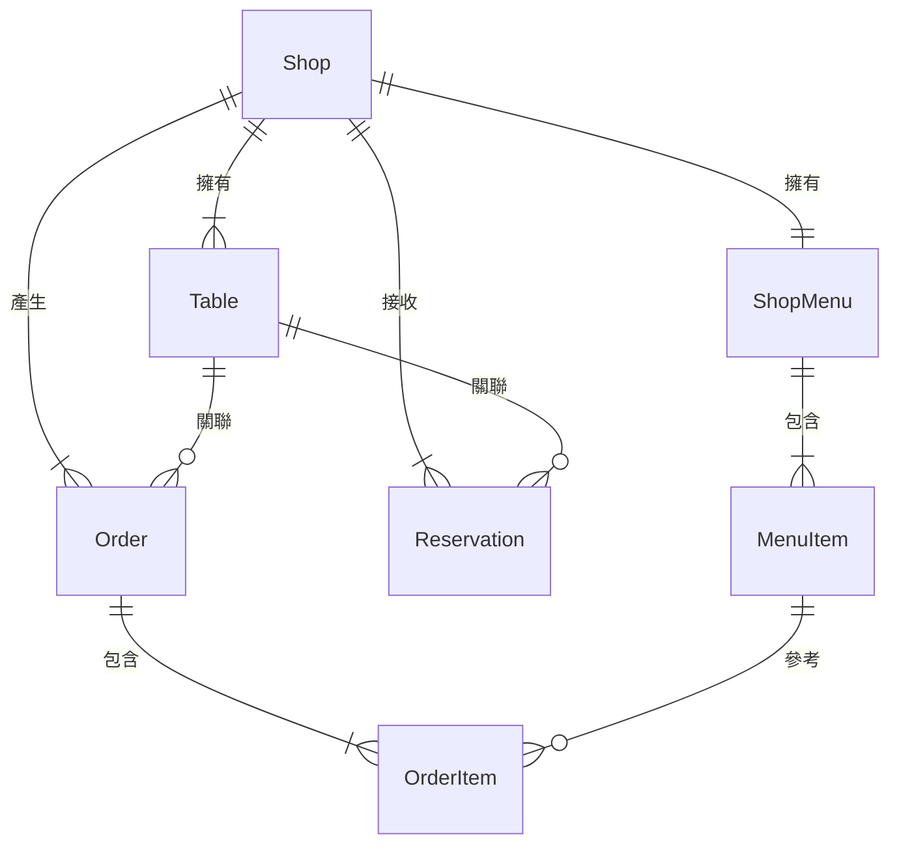

# SmartOrder 資料結構規範 (Data Structure Specification)

本文件定義了 SmartOrder 系統中核心實體（Entity）的資料結構，供開發人員與 AI 助理參考，確保資料一致性並利於未來遷移至雲端資料庫（如 Supabase/PostgreSQL）。

## 1. 店鋪體系 (Shop System)

店鋪是系統的核心實體，所有菜單、訂單、訂位皆歸屬於特定店鋪。

### A. Shop (店鋪)
| 欄位名 | 類型 | 說明 |
| :--- | :--- | :--- |
| `id` | `string` (UUID) | 店鋪唯一識別碼 |
| `name` | `string` | 店鋪名稱 |
| `ownerId` | `string` | 擁有者 ID |
| `createdAt` | `number` (Timestamp) | 建立時間 |

### B. Table (桌號)
| 欄位名 | 類型 | 說明 |
| :--- | :--- | :--- |
| `id` | `string` (UUID) | 桌號唯一識別碼 |
| `shopId` | `string` | 所屬店鋪的 ID (外鍵) |
| `tableNo` | `string` | 桌號名稱 (如 "A", "B", "C") |

---

## 2. 菜單體系 (Menu System)

菜單結構設計為「店鋪對應單一菜單」模式，支持 AI 解析後的結構化存儲。

### A. ShopMenu (菜單主體)
| 欄位名 | 類型 | 說明 |
| :--- | :--- | :--- |
| `id` | `string` (UUID) | 菜單唯一識別碼 |
| `shopId` | `string` | 所屬店鋪的 ID (外鍵) |
| `brandName` | `string` | 品牌/餐廳名稱 (由 AI 從圖片解析或手動輸入) |
| `categories` | `string[]` | 菜品分類清單，如 `["主食", "甜點"]` |
| `items` | `MenuItem[]` | 菜品細項陣列 |
| `isPublished` | `boolean` | 是否已發布（發布後方可生成點餐 QR Code） |

### B. MenuItem (菜品項目)
| 欄位名 | 類型 | 說明 |
| :--- | :--- | :--- |
| `id` | `string` (UUID) | 菜品唯一識別碼 |
| `name` | `string` | 菜色名稱 |
| `price` | `number` | 單價 |
| `category` | `string` | 所屬分類 (須對應 `ShopMenu.categories`) |
| `image` | `string` (Optional) | 圖片 URL 或 Base64 |

---

## 3. 訂單體系 (Order System)

訂單紀錄顧客的點餐內容、金額及處理狀態。

### A. Order (訂單主體)
| 欄位名 | 類型 | 說明 |
| :--- | :--- | :--- |
| `id` | `string` (UUID) | 訂單唯一識別碼 |
| `shopId` | `string` | 所屬店鋪的 ID |
| `tableNo` | `string` | 桌號 (如 "A1", "B2") |
| `items` | `OrderItem[]` | 訂購內容陣列 |
| `totalPrice` | `number` | 訂單總金額 (冗餘存儲以利報表計算) |
| `status` | `'new' \| 'served' \| 'paid'` | 狀態：新訂單、已出餐、已結帳 |
| `createdAt` | `number` (Timestamp) | 建立時間 |

### B. OrderItem (訂單細項)
為了防止菜單日後修改影響歷史訂單，訂單細項會快照當時的價格與名稱。
| 欄位名 | 類型 | 說明 |
| :--- | :--- | :--- |
| `menuItemId` | `string` | 原始菜品 ID (外鍵) |
| `name` | `string` | 點餐時的菜色名稱 |
| `price` | `number` | 點餐時的單價 |
| `quantity` | `number` | 數量 |

---

## 4. 訂位體系 (Reservation System)

訂位管理支援電話預訂與現場候位，追蹤顧客入座狀態。

### A. Reservation (訂位)
| 欄位名 | 類型 | 說明 |
| :--- | :--- | :--- |
| `id` | `string` (UUID) | 訂位唯一識別碼 |
| `shopId` | `string` | 所屬店鋪的 ID (外鍵) |
| `time` | `string` | 預約時間 |
| `tableNo` | `string` | 預約桌號 |
| `phone` | `string` | 聯絡電話 |
| `source` | `'預訂' \| '現場'` | 來源：電話預訂或現場候位 |
| `status` | `'待入座' \| '已入座' \| '已取消'` | 訂位狀態 |
| `checkInTime` | `number` (Optional, Timestamp) | 簽到時間（入座時記錄） |

---

## 5. 資料關聯圖 (Relationship Concept)

---

## 6. 擴展性備註 (Extensibility)
- **多幣別**: 未來可在 `ShopMenu` 加入 `currency` 欄位。
- **客製化選項**: `OrderItem` 預留 `options` 欄位（如：去冰、微辣）的擴展空間。
- **物理刪除 vs 邏輯刪除**: 目前採用直接刪除，未來建議在 `MenuItem` 加入 `isDeleted` 標記以維護歷史訂單連貫性。